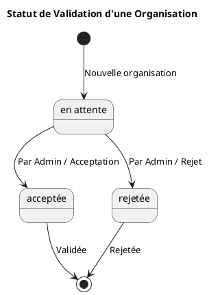
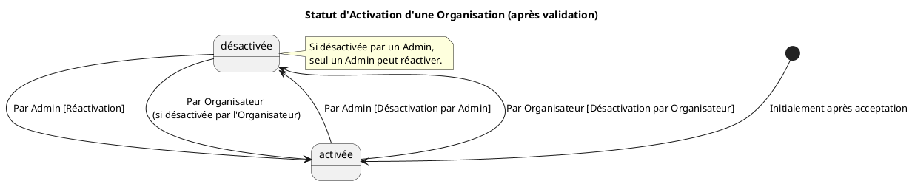

# Diagrammes d'État des Organisations

## 1. Statut de Validation d'une Organisation

Ce diagramme illustre le processus de validation d'une organisation. Une organisation commence en état 'en attente'. Un administrateur peut ensuite l'approuver, la faisant passer à l'état 'acceptée', ou la refuser, la menant à l'état 'rejetée'.

## 2. Statut d'Activation d'une Organisation

Ce diagramme représente l'état d'activation d'une organisation qui a déjà été validée (acceptée). Une organisation est initialement 'activée'. Elle peut être 'désactivée' par un administrateur ou par l'organisateur responsable. Sa réactivation dépend de qui a effectué la désactivation : si c'est un administrateur, seul un administrateur peut la réactiver ; si c'est l'organisateur, l'organisateur lui-même ou un administrateur peut la réactiver.

