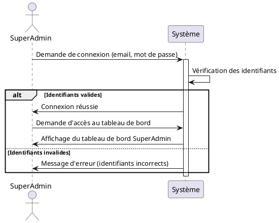
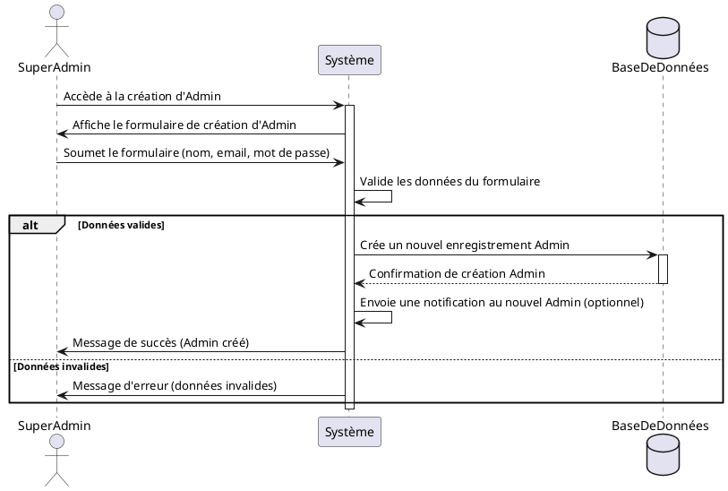
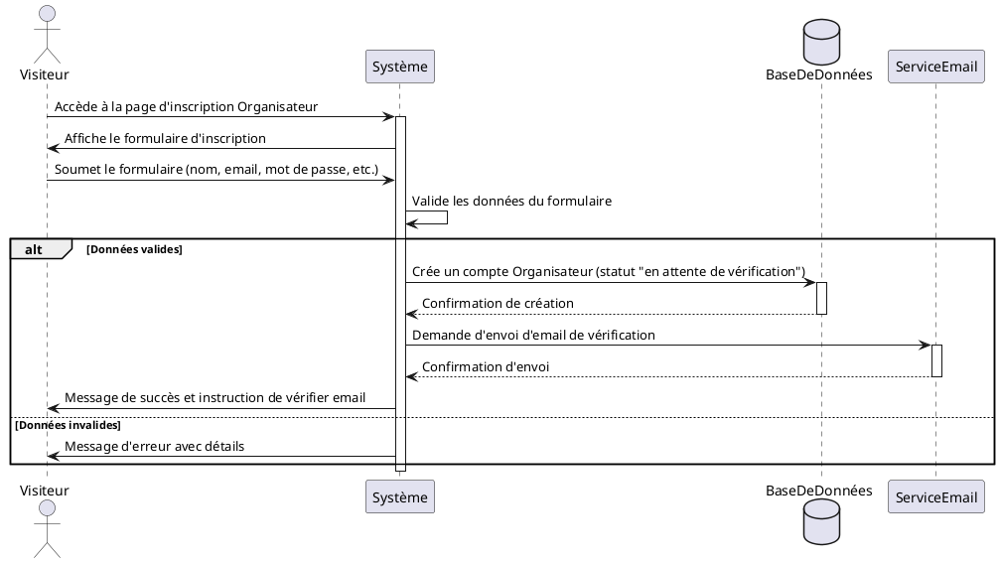
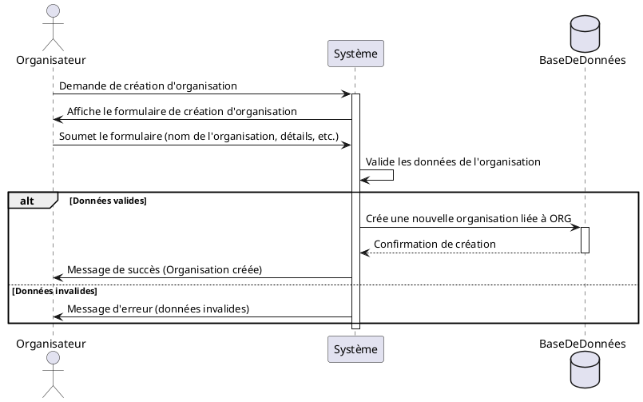
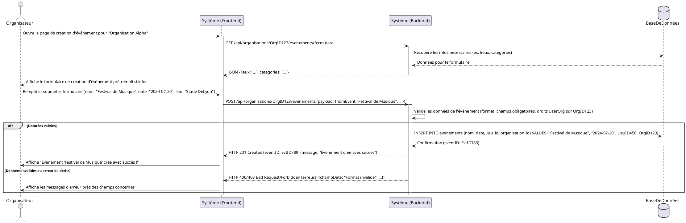
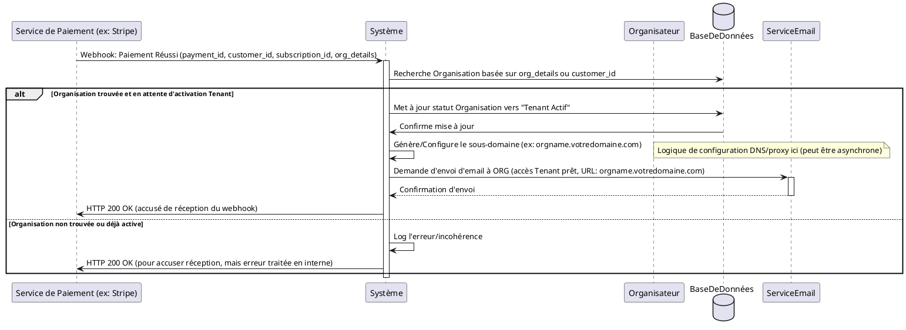

# Diagrammes de Séquence PlantUML

## 1. Connexion du SuperAdmin

Description en français : Le SuperAdmin demande à se connecter. Le système vérifie les identifiants. Si les identifiants sont valides, le SuperAdmin est connecté et redirigé vers son tableau de bord. Sinon, un message d'erreur est affiché.

## 2. Création d'un Admin par le SuperAdmin

Description en français : Le SuperAdmin, une fois connecté, accède à la fonctionnalité de création d'administrateur. Il remplit un formulaire avec les informations du nouvel administrateur et soumet. Le système valide les données. Si elles sont valides, le nouvel administrateur est créé, une notification est envoyée, et le SuperAdmin est informé du succès. Sinon, un message d'erreur est affiché.

## 3. Inscription d'un Organisateur

Description en français : Un visiteur souhaite s'inscrire en tant qu'organisateur. Il remplit le formulaire d'inscription. Le système valide les données. Si valides, un nouveau compte organisateur est créé, un email de vérification est envoyé, et un message de succès s'affiche. Sinon, des erreurs sont montrées.

## 4. Création d'une Organisation par l'Organisateur

Description en français : L'organisateur, après s'être connecté et avoir fait vérifier son compte, souhaite créer une nouvelle organisation. Il remplit un formulaire avec les détails de l'organisation. Le système valide ces informations. Si elles sont correctes, l'organisation est créée et associée à l'organisateur. Un message de succès est affiché. Sinon, des erreurs sont indiquées.

## 5. Création d'un Événement par l'Organisateur

Description en français : L'organisateur, connecté et ayant sélectionné une organisation, souhaite créer un nouvel événement. Il remplit un formulaire avec les détails de l'événement (nom, date, lieu, etc.). Le système valide ces informations. Si correctes, l'événement est créé et associé à l'organisation. Un message de succès est affiché. Sinon, des erreurs sont indiquées. (Note : Les noms des participants sont hypothétiques pour illustrer le flux.)

## 6. Initialisation de l'accès Tenant (après paiement validé)

Description en français : Suite à la validation du paiement pour un abonnement (par exemple, par Stripe), le système doit initialiser l'accès "Tenant" pour l'organisation. Cela implique la création ou l'activation de l'organisation en tant que Tenant, la configuration de son sous-domaine, et la notification à l'organisateur.

